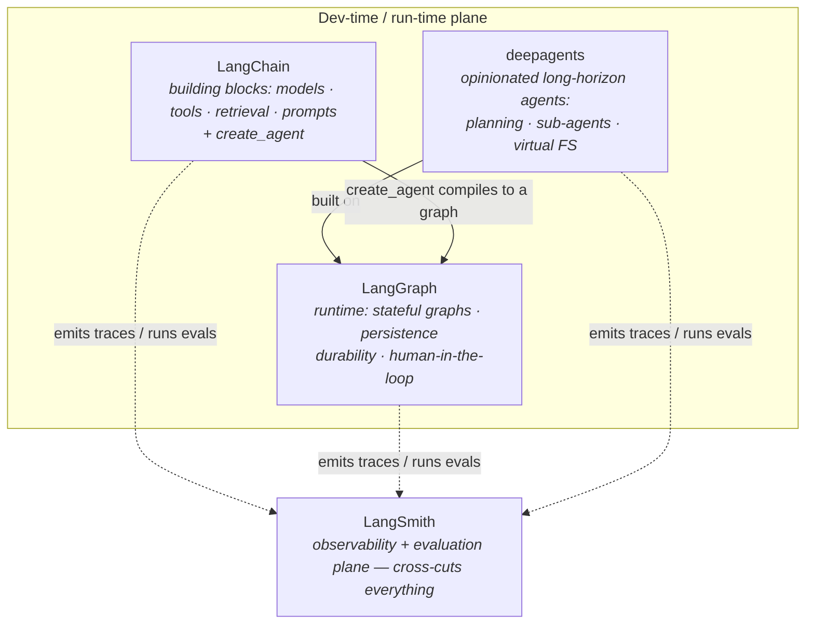
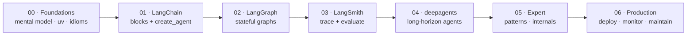
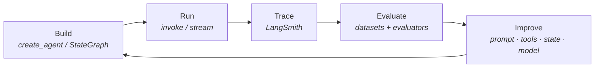

# learn-harness

A guided, source-grounded path from **basic to expert** across the LangChain stack:

- **LangChain** — the model/tool/retrieval building blocks and the `create_agent` runtime.
- **LangGraph** — the low-level orchestration runtime for stateful, durable, multi-agent systems.
- **LangSmith** — observability, evaluation, and prompt management for shipping reliable agents.
- **deepagents** — the higher-level library (built on LangGraph) for long-horizon "deep" agents: planning, sub-agents, virtual filesystem, and durable task execution.

Two angles run through every track: **using** the library (the public API) and **implementing** with/under it — the internals that explain *why* the API is shaped the way it is, plus recipes for building real features on top.

This repo is built to be *consumed in order*. The `docs/` tree teaches every concept in depth; the `examples/` tree (added in a later pass) mirrors the docs with runnable code managed by [`uv`](https://docs.astral.sh/uv/).

> Target versions: **LangChain 1.x**, **LangGraph 1.x**, **LangSmith SDK (current)**. The v1 line is a real break from the 0.x tutorials you'll find scattered online — this course teaches the current APIs (`langchain.agents.create_agent`, middleware, `StateGraph` with typed state + reducers, `client.evaluate`), and flags where older material will mislead you.

---

## Who this is for

You've scratched the surface — run a quick chain, maybe a `create_react_agent` demo — and you want the *design-level* understanding: when to reach for LangChain vs LangGraph, how state and persistence actually work, how to build multi-agent systems that don't fall over, and how to make all of it observable and continuously evaluated. By the end you should be able to reason about **specific challenges and patterns**, not just copy quickstarts.

## How to use this repo

1. Read `docs/00-foundations` first — mental model + environment.
2. Work through `docs/01-langchain`, then `docs/02-langgraph`, then `docs/03-langsmith`, then `docs/04-deepagents`. Each builds on the last.
3. Consolidate with `docs/05-expert` — the cross-cutting design patterns (loop/graph engineering, context engineering, internals) that separate a demo from a system.
4. Finish with `docs/06-production` — deploy, monitor, and maintain as a repeatable pattern.
5. As the `examples/` folders land, run each module's code alongside the doc. Every example is a standalone `uv` project.

Each doc follows the same shape:

- **Mental model** — the one idea to hold in your head.
- **In depth** — the APIs, with current code.
- **Why it matters** — the design tradeoff behind the feature.
- **Pitfalls** — what breaks in practice, including stale-tutorial traps.
- **Exercises** — do these before moving on.
- **Further reading** — official sources.

## The loop this course teaches

The spine of everything here is one feedback loop. You don't ship a run — you ship the loop that keeps making the run better.

## Curriculum map

| Track | Folder | You'll be able to… |
|-------|--------|--------------------|
| Foundations | `docs/00-foundations` | Explain the ecosystem and set up a clean `uv` workspace |
| LangChain | `docs/01-langchain` | Compose models, tools, retrieval, and agents with `create_agent` + middleware |
| LangGraph | `docs/02-langgraph` | Design stateful graphs, persistence, HITL, and multi-agent systems |
| LangSmith | `docs/03-langsmith` | Trace, evaluate, and manage prompts for production reliability |
| deepagents | `docs/04-deepagents` | Build long-horizon agents with planning, sub-agents, and a virtual filesystem |
| Expert | `docs/05-expert` | Apply design patterns, loop/graph engineering, internals, and eval-driven development |
| Production | `docs/06-production` | Deploy, monitor, and maintain an agentic app as a repeatable pattern |

## Prerequisites

- Python 3.11+ and `uv` (`curl -LsSf https://astral.sh/uv/install.sh | sh`).
- An LLM API key (Anthropic and/or OpenAI). Set `ANTHROPIC_API_KEY` / `OPENAI_API_KEY`.
- A LangSmith account + `LANGSMITH_API_KEY` for the observability/eval tracks (free tier is enough).

See `docs/00-foundations/02-environment-setup-uv.md` for exact setup.
